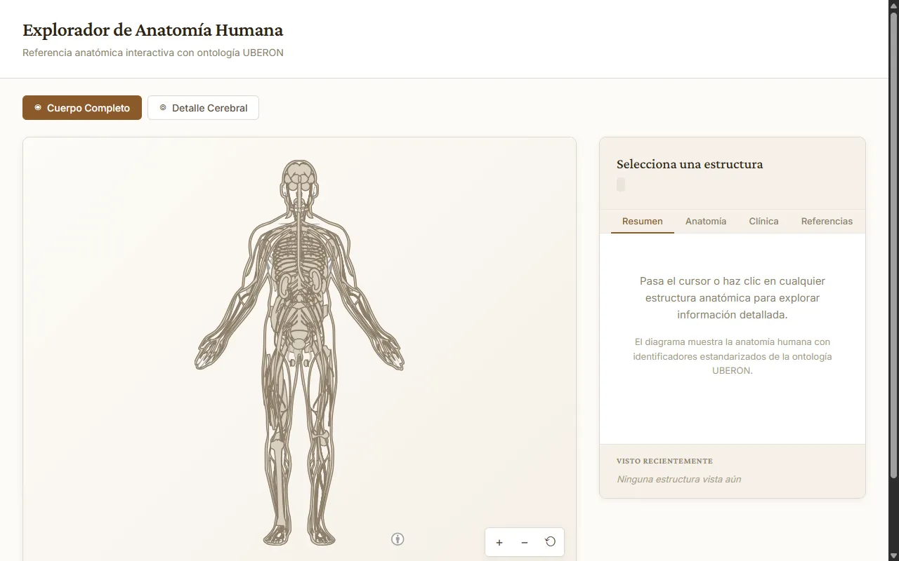
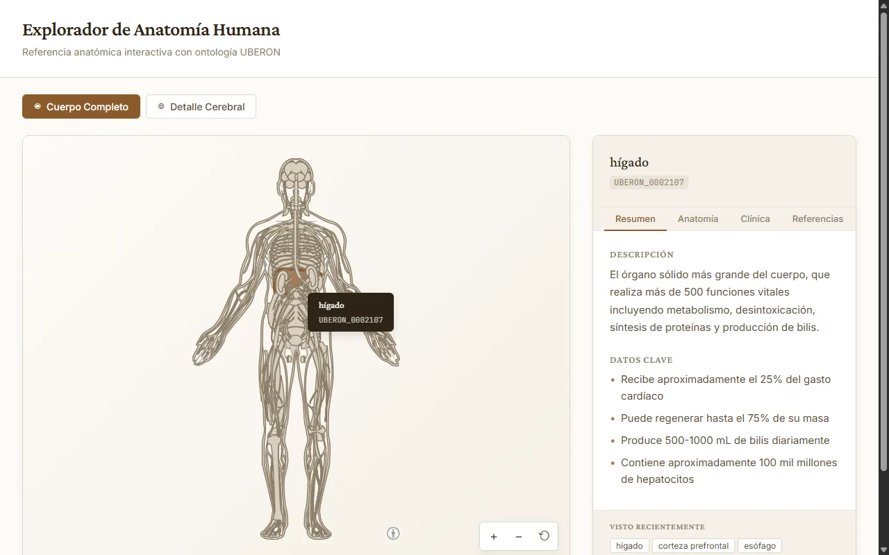
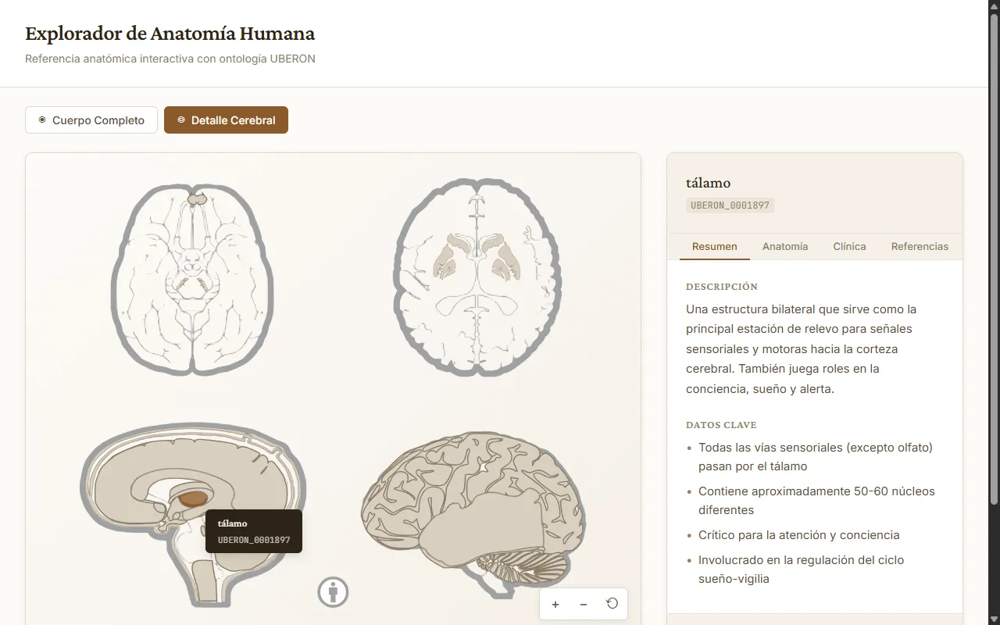
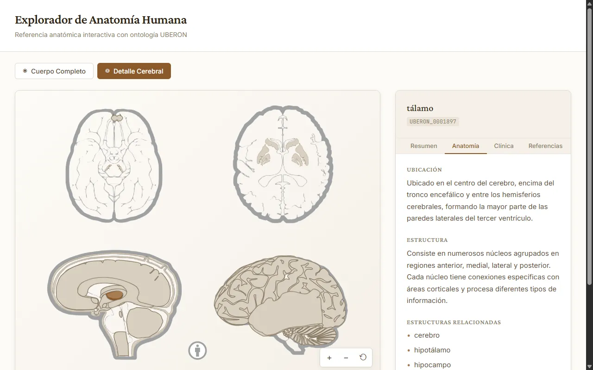
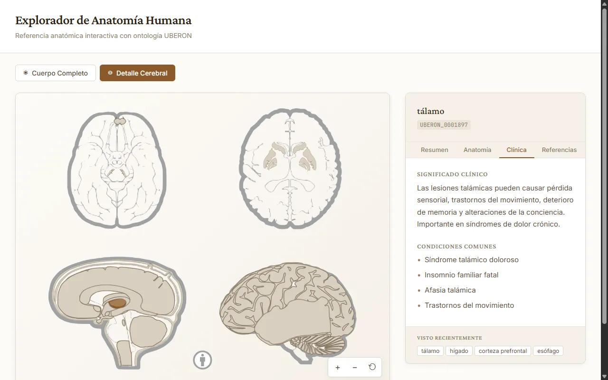

# 🧬 Explorador de Anatomía Humana

<div align="center">



**Aplicación web interactiva de referencia anatómica con ontología UBERON**

[](https://vitejs.dev/)
[](https://developer.mozilla.org/es/docs/Web/JavaScript)
[](LICENSE)

</div>
 
[Demo en vivo](https://human-body.webcode.es) — Versión desplegada

---

## 📖 Descripción

El **Explorador de Anatomía Humana** es una aplicación web educativa e interactiva que permite explorar la anatomía del cuerpo humano a través de diagramas SVG detallados. Cada estructura anatómica está identificada con su correspondiente código de la ontología [UBERON](http://uberon.org/), proporcionando una referencia estandarizada y científicamente precisa.

### ✨ Características Principales

- 🎨 **Diagramas SVG interactivos** del cuerpo humano completo y del cerebro
- 🔍 **Información detallada** de cada estructura anatómica al hacer clic
- 📚 **Cuatro pestañas informativas**: Resumen, Anatomía, Clínica y Referencias
- 🏷️ **Identificadores UBERON** estandarizados para cada estructura
- 🔊 **Retroalimentación de audio** sutil para una experiencia inmersiva
- 📱 **Diseño responsive** adaptado a diferentes dispositivos
- 🌐 **Completamente en español** con nombres anatómicos localizados
- ⌨️ **Navegación por teclado** para accesibilidad
- 🔎 **Controles de zoom** para explorar el diagrama en detalle
- 📜 **Historial de navegación** para revisar estructuras visitadas

---

## 🖼️ Capturas de Pantalla

### Vista Principal - Cuerpo Completo


_Diagrama interactivo del cuerpo humano con todas las estructuras principales_

### Detalle de Estructura - Información del Hígado


_Panel informativo mostrando descripción y datos clave de una estructura_

### Vista del Cerebro - Tálamo


_Diagrama especializado del cerebro con estructuras neuroanatómicas_

### Pestaña Anatomía


_Información sobre ubicación, estructura y órganos relacionados_

### Pestaña Clínica


_Significado clínico y condiciones médicas asociadas_

---

## 🚀 Instalación y Uso

### Requisitos Previos

- [Node.js](https://nodejs.org/) (versión 18 o superior)
- [pnpm](https://pnpm.io/) (recomendado) o npm

### Instalación

```bash
# Clonar el repositorio
git clone https://github.com/JordiNodeJS/human-anatomy-explorer.git
cd human-anatomy-explorer

# Instalar dependencias
pnpm install

# Iniciar servidor de desarrollo
pnpm dev
```

La aplicación estará disponible en `http://localhost:3000`

### Comandos Disponibles

| Comando        | Descripción                           |
| -------------- | ------------------------------------- |
| `pnpm dev`     | Inicia el servidor de desarrollo      |
| `pnpm build`   | Genera la versión de producción       |
| `pnpm preview` | Previsualiza la versión de producción |

---

## 🏗️ Estructura del Proyecto

```
human-anatomy-explorer/
├── public/
│   ├── locales/
│   │   ├── en.json          # Traducciones inglés (vacío)
│   │   └── es.json          # Traducciones español
│   └── screenshots/          # Capturas de pantalla
├── src/
│   ├── anatomyData.js       # Datos de estructuras anatómicas
│   ├── audioFeedback.js     # Sistema de retroalimentación sonora
│   ├── main.js              # Lógica principal de la aplicación
│   └── styles.css           # Estilos de la aplicación
├── index.html               # Página principal
├── package.json             # Dependencias y scripts
└── vite.config.js           # Configuración de Vite
```

---

## 🔬 Tecnologías Utilizadas

- **[Vite](https://vitejs.dev/)** - Build tool ultrarrápido para desarrollo web
- **[Anatomogram](https://www.npmjs.com/package/@ebi-gene-expression-group/anatomogram)** - Diagramas SVG anatómicos de EMBL-EBI
- **[Web Audio API](https://developer.mozilla.org/es/docs/Web/API/Web_Audio_API)** - Retroalimentación de audio interactiva
- **[UBERON](http://uberon.org/)** - Ontología de anatomía multiespecie

---

## 📊 Datos Anatómicos

La aplicación incluye información detallada sobre más de 20 estructuras anatómicas principales, incluyendo:

### 🧠 Sistema Nervioso

- Cerebro, Corteza Cerebral, Hipocampo
- Tálamo, Hipotálamo, Cerebelo
- Lóbulos Frontal y Temporal

### ❤️ Sistema Cardiovascular

- Corazón, Pulmones

### 🫁 Sistema Digestivo

- Estómago, Hígado, Colon
- Páncreas, Bazo

### 🔬 Sistema Urinario

- Riñón, Vejiga Urinaria

### ⚗️ Sistema Endocrino

- Glándula Tiroides, Glándula Suprarrenal

### 👁️ Órganos Sensoriales

- Ojo

---

## ⌨️ Atajos de Teclado

| Tecla     | Acción                                                           |
| --------- | ---------------------------------------------------------------- |
| `1-4`     | Cambiar entre pestañas (Resumen, Anatomía, Clínica, Referencias) |
| `+` o `=` | Acercar zoom                                                     |
| `-`       | Alejar zoom                                                      |
| `0`       | Restablecer zoom                                                 |
| `Esc`     | Limpiar selección                                                |

---

## 📝 Licencia

Este proyecto está bajo la Licencia MIT. Ver el archivo [LICENSE](LICENSE) para más detalles.

### Atribuciones

- **Ilustraciones anatómicas**: [Anatomogram](https://github.com/ebi-gene-expression-group/anatomogram) © [Expression Atlas, EMBL-EBI](https://www.ebi.ac.uk/gxa) bajo licencia CC BY 4.0
- **Datos de ontología**: [UBERON](http://uberon.org/) - Ontología de anatomía multiespecie

---

## 🤝 Contribuciones

Las contribuciones son bienvenidas. Por favor:

1. Haz fork del repositorio
2. Crea una rama para tu feature (`git checkout -b feature/nueva-funcionalidad`)
3. Realiza tus cambios y haz commit (`git commit -m 'Añade nueva funcionalidad'`)
4. Sube los cambios (`git push origin feature/nueva-funcionalidad`)
5. Abre un Pull Request

---

## 👨‍💻 Autor

Desarrollado con ❤️ para la comunidad educativa y médica.

---

<div align="center">

**[⬆ Volver arriba](#-explorador-de-anatomía-humana)**

</div>
